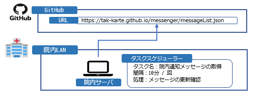
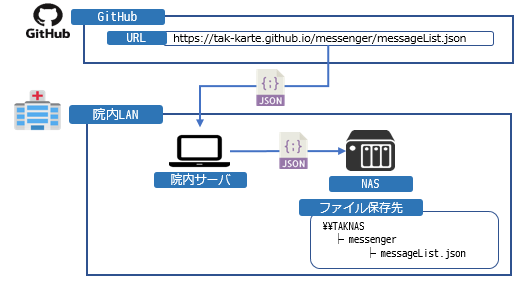
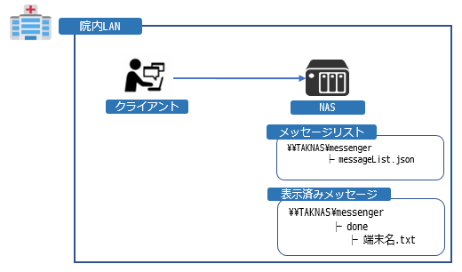
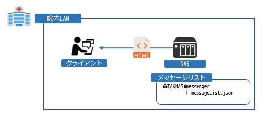
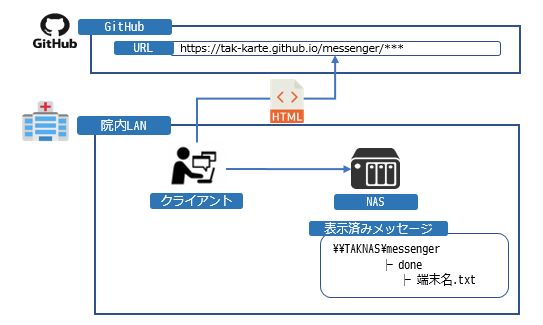

<link href="../@css/github-markdown.css" rel="stylesheet"></link>

# 院内通知メッセージについて

<div style="text-align: right;">
    <font color="silver">
        更新日：2021/08/23　tak)waki
    </font>
</div>

## 動画テスト
tak-karte-test-mp4

iframe
<iframe src="https://players.brightcove.net/6241658428001/default_default/index.html?videoId=6269281511001" allowfullscreen="" allow="encrypted-media" width="960" height="540"></iframe>

video
<video-js data-account="6241658428001" data-player="default" data-embed="default" controls="" data-video-id="6269281511001" data-playlist-id="" data-application-id="" width="960" height="540"></video-js><script src="https://players.brightcove.net/6241658428001/default_default/index.min.js"></script>


url
https://bcove.video/3msViwL


## この機能について
TAKから電子カルテがインストールされている全端末に対してHTMLを表示することが可能です    
現在想定している利用シーンは以下をを想定しています  

- 資源更新に伴うシステム停止時間を事前に通知
- システム障害による電子カルテ停止時の案内


## メッセージ通知単位
本機能では以下の表示設定が可能です

- 表示開始日時
- 表示終了日時
- 表示対象資源区分 (beta or stagging or product)

また、以下の単位では表示対象を指定することが出来ませんので気を付けてください

- 施設を指定した通知
- 端末を指定した通知
- 利用者を指定した通知


## メッセージ表示までの仕組み
データの流れは以下の図をご参照ください

### 院内サーバ
1. メッセージの更新確認  


2. メッセージの更新が発生した場合は`messeageList.json`をNASにコピーする  


### クライアント
1. 定期的にNASに新着メッセージ存在するか確認する  


2. 新着メッセージが存在する場合は`messeageList.json`から`表示URL`を取得する  


3. 取得した`URL`を起動し、NAS上の表示済みメッセージファイルを更新する  



## Gitの構成
GitHubのPagesの仕様を利用して実装しています  
GitHub上のフォルダ構成は以下の通り  

リポジトリ：https://github.com/tak-karte/messenger.git

```java
root（公開リポジトリ）
├ docs  // html公開: https://tak-karte.github.io/messenger/
│  ├ css // htmlに適用するスタイルシートを格納
│  │  ├ ***
│  ├ resource // htmlに表示するリソース(画像など)を格納
│  │  ├ ***
│  ├ index.html // urlの指定がされなかった際のデフォルトページ
│  ├ messageList.json // メッセージリスト
│  ├ robots.txt // Googleクローラー対策
│
├ *** (html非公開エリア)
```


## messageList.jsonの仕様
```json
{
    "messageList": [
        {
            // 一意のキーを設定(更新日時)
            "id": "20210613130000",
            // メッセージタイトル
            "title": "2021年4月度診療報酬改定の対応について",
            // 表示対象資源区分
            "env": [
                "dev",
                "beta",
                "stagging",
                "product"
            ]
            // 表示対象開始日時
            "valid_start_date_time": "2021/06/13 13:00:00",
            // 表示対象終了日時
            "valid_end_date_time": "2021/06/30 23:59:59",
            // 表示URL
            "url": "https://tak-kohwaki.github.io/test-page/20210613130000/",
            // メモ
            "memo": "テストメッセージです"
        },
        {
            "id": "20210613150000",
            "title": "2021年レベルアップついて",
            "env": [
                "dev"
            ],
            "valid_start_date_time": "2021/06/10 13:00:00",
            "valid_end_date_time": "2021/06/25 23:59:59",
            "url": "https://tak-kohwaki.github.io/test-page/20210613150000/",
            "memo": "テストメッセージ２です"
        }
    ],
    // 更新日時
    "last_upate_date_time": "2021/06/14 10:00:00",
    // 更新者
    "last_upate_name": "tak)waki"
}
```

## 院内メッセージ通知の発行方法

1. GitHubからリポジトリをクローンする
   - 本番リポジトリ：https://github.com/tak-karte/messenger.git
   - テストリポジトリ：https://github.com/tak-karte/messenger-test.git

2. メッセージリストを更新する
    ```bash
    docs/messageList.json
    ```
    更新内容は上記`[messageList.jsonの仕様]`を参照ください

3. 表示するhtmlを作成する
    ```bash
    docs/***.html
    ```

4. GitHubへプッシュする  
    5分ほどで自動デプロイされて確認することが可能です
